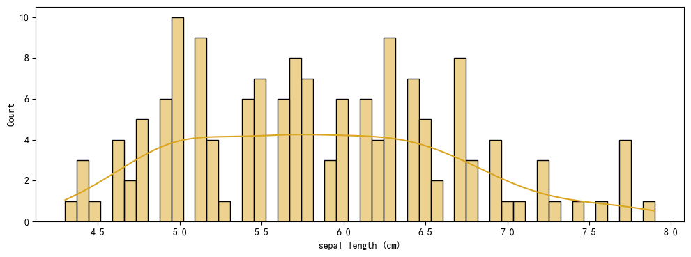

# 说明文档
在数据挖掘和机器学习领域，有许多工作是重复并具有规律的。每次都去完成相似的工作，不仅枯燥乏味也降低了工作效率。
基于此，本人在许多优秀第三方库(如pandas、sklearn、seaborn等)的基础上，整合完善了代码流程，开发了第三方库my。可以帮助用户快速方便的完成数据挖掘、
机器学习建模、自动化调参、可视化、nlp预处理等工作。

## 目录
- [数据挖掘](#数据挖掘)
- [机器学习建模](#机器学习建模)
- [自动化调参](#自动化调参)
- [nlp预处理](#nlp预处理)

## 功能注解及参数说明
my包主要分为四个功能：数据挖掘、机器学习建模、自动化调参、nlp预处理。

说明文档中，会说明函数的用途并展示示例效果，还会对函数或类中的参数进行详细地解释。

***注1：本文档的所有实例代码仅为演示，模型效果并未达到最佳，不具备实际项目中的指导意义***
***注2：my包中有部分用于深度学习的函数尚未完整测试，暂不建议使用***
### 数据挖掘
#### 1.ViewDataframe

开始一个项目之前，了解你的数据是很有必有的。ViewDataframe整合了pandas的常用函数，可以一次性输出对数据的概述。

这里使用鸢尾花数据集作为示例。

```
# 导入包并命名为my
# my包已经包含了如pandas、numpy等常用第三方库，只需导入my即可，这样不用每次编写新代码时进行多次调包。
from my import source as my
from sklearn.datasets import load_iris

# 加载鸢尾花数据集
iris = load_iris()

# 直接将数据集转换为DataFrame，并添加列名和类别名称
iris_df = my.pd.DataFrame(data=iris.data, columns=iris.feature_names)
iris_df['species'] = iris.target

# 使用my的ViewDataframe类查看数据
viewer = my.ViewDataframe(df=iris_df)
viewer.display_info()
```
输出结果如下：包括数据维度、特征类型、缺失值信息、重复值信息、数据的前五行和后五行。
```

--- 数据维度 ---
维度: 150 行 x 5 列

--- 特征类型 ---
                      数据类型
sepal length (cm)  float64
sepal width (cm)   float64
petal length (cm)  float64
petal width (cm)   float64
species              int32

--- 缺失值信息 ---
                   缺失值统计 缺失值占比 (%)
sepal length (cm)      0     0.00%
sepal width (cm)       0     0.00%
petal length (cm)      0     0.00%
petal width (cm)       0     0.00%
species                0     0.00%

--- 重复值信息 ---
重复行统计        2
重复行占比    1.33%
dtype: object

--- 数据展示(前五行+后五行) ---
     sepal length (cm)  sepal width (cm)  petal length (cm)  petal width (cm)  \
0                5.100             3.500              1.400             0.200   
1                4.900             3.000              1.400             0.200   
2                4.700             3.200              1.300             0.200   
3                4.600             3.100              1.500             0.200   
4                5.000             3.600              1.400             0.200   
145              6.700             3.000              5.200             2.300   
146              6.300             2.500              5.000             1.900   
147              6.500             3.000              5.200             2.000   
148              6.200             3.400              5.400             2.300   
149              5.900             3.000              5.100             1.800   

     species  
0          0  
1          0  
2          0  
3          0  
4          0  
145        2  
146        2  
147        2  
148        2  
149        2  

```
类参数:

df: 接受一个dataframe。

方法:

get_dimensions: 获取数据维度。

get_column_types: 获取特征类型。

count_missing_values: 统计缺失值信息。

count_duplicates: 统计重复值信息。

preview_data: 展示数据框前五行和后五行。

display_info: 整合上述五个功能，批量输出。
#### 2.describe_plus
describe_plus是pandas数据框describe函数的强化版，在原先的基础上，增加了对变量峰度、偏度、正态性检验的计算。
```
# 仍旧使用鸢尾花数据集
result = my.describe_plus(df=iris_df.iloc[:, :-1])
```
输出结果如下：下面的文档中只展示了输出的纯文本。如果你使用的是jupyter，看到的应该是一个表格。
```
                    count  mean   std   min   25%   50%   75%   max  Skewness  \
sepal length (cm) 150.000 5.843 0.828 4.300 5.100 5.800 6.400 7.900     0.312   
sepal width (cm)  150.000 3.057 0.436 2.000 2.800 3.000 3.300 4.400     0.316   
petal length (cm) 150.000 3.758 1.765 1.000 1.600 4.350 5.100 6.900    -0.272   
petal width (cm)  150.000 1.199 0.762 0.100 0.300 1.300 1.800 2.500    -0.102   

                   Kurtosis  Normality Test (p-value)  
sepal length (cm)    -0.574                     0.057  
sepal width (cm)      0.181                     0.210  
petal length (cm)    -1.396                     0.000  
petal width (cm)     -1.336                     0.000  
```
参数:

df: 接受一个dataframe。注意，这里应该接受的是连续型变量，如上面示例中只选择了四个连续型的特征变量，没有选择离散变量species。
对于离散型变量，许多统计指标没有计算意义。

返回值：

result: 数据框的统计结果。
#### 3.DataVisualization
可视化是数据挖掘中绕不开的话题。虽然对于连续型变量、离散型变量、文本型变量有着不同的可视化方法，但是有一些相似的规律。比如连续型变量经常需要查看
变量的分布情况，离散型变量需要统计数量等。DataVisualization可以方便的对数据进行批量绘图。当然，如果你需要研究的变量很多很杂，
建议你自行编写函数进行可视化。
```
# 选择变量
num_var = list(iris_df.iloc[:, :-1].columns)
# 实例化
plot = my.DataVisualization(iris_df, num_var=num_var)
# 绘制变量分布图
plot.histogram_plot(color='gold', figsize=(12,4))
# 绘制字母值图
plot.box_plot(color='orangered')
# 绘制相关性热力图
plot.heatmaps(var_list=num_var, cmap='Blues', half=False, figsize=(5,5))
# 绘制散点图
num_var = ['sepal length (cm)', 'sepal width (cm)', 'petal length (cm)']
plot = my.DataVisualization(iris_df, num_var=num_var)
plot.join_plot(dependent_variable='petal width (cm)', hue='species', kind='scatter')
# 绘制条形统计图
cat_var = ['species']
plot = my.DataVisualization(iris_df, cat_var=cat_var)
plot.count_plot()
# 绘制分组条形统计图
df = my.pd.read_csv(r'../my/data/train.csv')
df['Exited'] = df['Exited'].astype(str)
cat_var = ['Geography', 'Gender']
plot = my.DataVisualization(df, cat_var=cat_var)
```
输出结果如下：由于是批量绘制，这里每种类型的图只展示一种。

由于不同人使用不同的IDE，IDE的背景主题不同会导致图形的颜色，具体使用时可以灵活修改。



类参数:

df: dataframe。数据框。

num_var: list。df中连续型变量的列名称，存储在列表里。

cat_var: list。df中类别型变量的列名称，存储在列表里。

方法参数: 

1.histogram_plot

fig_type: str。变量分布图y轴的类型，默认值为'count'。支持类型包括'count(每个分箱中的观测数)','frequency(观测数除以分箱宽度)',
'probability(归一化，条形高度值和为1)','percent(规范化，使条形高度之和为 100)','density(归一化，使直方图的总面积等于 1)'。

hue: str。分类变量名称，默认值为None。

bins: int。分箱的数量，默认值为50

palette: str。调色板，默认值是'Set3'，如果hue为None，则这个参数默认为None。

color: str。颜色，默认值是gold，接受matplotlib的颜色。

figsize: tuple。图形大小，默认值(18,6)

2.join_plot

dependent_variable: str。响应变量，即y轴的数据。

kind: str。图形的类型，默认值'hex'。支持类型包括'hex','scatter','hist','kde','reg','resid'。

color: str。颜色，默认值是gold，接受matplotlib的颜色。

hue: str。分类变量名称，默认值为None。*注意：join_plot的hue参数对于某些图形类型比如'hex'可能不适用*

palette: str。调色板，默认值是'Set3'，如果hue为None，则这个参数默认为None。

3.box_plot

continuous_variable: str。连续型变量。

categorical_variable: str。类别型变量，用于绘制多个不同类别在同一属性下的字母值图。

classified: bool，默认是False。是否绘制分类图，如果是False则categorical_variable无用。

color: str。颜色，默认值是gold，接受matplotlib的颜色。

hue: str。分类变量名称，默认值为None。

palette: str。调色板，默认值是'Set3'，如果hue为None，则这个参数默认为None。

figsize: tuple。图形大小，默认值(8,6)

***注：hue和categorical_variable是不同的。比如你想研究男性和女性周一至周五的工作时长，则工作时长是continuous_variable，
周一至周五是categorical_variable，hue则是性别***

4.count_plot

hue: str。分类变量名称，默认值为None。

palette: str。调色板，默认值是'Set3'，如果hue为None，则这个参数默认为None。

figsize: tuple。图形大小，默认值(8,6)。

max_categories_for_rotation: int。最大类别数，默认值是10。

rotation_angle: int。默认值是45，如果类别数大于max_categories_for_rotation，则会选择x轴的标签避免重叠。

color: str。颜色，默认值是g，接受matplotlib的颜色。

5.heatmap

var_list: list。计算相关性系数的变量名称。

cmap: str。颜色映射空间，默认值'Blues'。可参考MatplotLib 颜色映射表名称。

annot: bool。是否显示数值，默认值True。

vmin,vmax: int|float。控制热力图中颜色映射的范围，默认是-1到1。

square: bool。默认值为True。如果设置为 True，则热力图中的每个单元格会被强制为正方形，这有助于保持视觉上的比例一致性和美观。

figsize: tuple。图形大小，默认值(10,10)。

fmt: str。默认值是'.2f'。用于控制显示的小数位数。

halt: bool。默认值是False。如果设置为True，这只会展示下三角，这在有时候会有用。

上述功能应该是大多数数据挖掘或机器学习项目中常用到的，但它们只是一个项目的冰山一角。除此之外，你还需要根据不同的项目和场景做很多的预处理工作，这些
都是无法使用通用代码解决的。对于新人，个人强烈建议学习pandas,matplotlib,seaborn,numpy等python优秀的第三方库，熟练掌握后相信你一定能开发出比
我这些更加灵活和通用的代码。
### 机器学习建模
#### 1.cut_data
无论你考虑建立何种模型，划分数据集都是有必要的。cut_data是一个在train_test_split基础上打包的简单函数，你可以通过参数控制如何划分你的数据集。
```
# 拆分鸢尾花数据集
X = iris_df.iloc[:, :-1]
y = iris_df.iloc[:, -1]
X_trainval, X_test, y_trainval, y_test = my.cut_data(X, y, stratified=True)
```
参数:

X: list|array|scipy-sparse matrices|dataframe。特征变量。

y: list|array|scipy-sparse matrices|dataframe。响应变量。

test_size: float。默认值0.3.拆分比例，保留多大比例的测试集。

stratified: bool。默认是False。如果是True，则会启用stratify=y，采用分层抽样。

shuffle: bool。默认是True。如果是True，则打乱数据并启用随机数种子。
#### 2.kf_choice
kf_choice可以根据参数选择k折交叉验证的方式。由于my包会在训练和验证数据中自动启用这个函数，用户一般不会直接使用，因此没有使用示例。若敢兴趣，请
参考源码。

参数：

n_splits: int。默认值是10。选择进行几折交叉验证。

stratified: bool。默认值是False。如果是True，则会采用StratifiedKFold的交叉验证策略。StratifiedKFold与KFold都是是将数据集分割成 K 个折叠，
但它会尽量保持每个折叠中各类别的比例与整个数据集中的类别比例一致。这意味着，对于分类问题，特别是类别不平衡的数据集，
StratifiedKFold 可以确保训练集和验证集中类别分布的相似性，从而避免了因为类别分布不均导致的评估偏差。

shuffle: bool。默认是True。如果是True，则打乱数据并启用随机数种子。
#### 3.Timer
建模时，性能是人们十分关注的一点。Timer类是一个计时器，是李沐团队《动手学习深度学习PyTorch》书中代码的简化版。Timer是后续建模函数中的组件之一。
```
# 实例化时自动开启计时
timer = my.Timer()
# 使用stop停止
total_time = timer.stop()
# 查看时间
print(total_time)
```
#### 4.train_regression_baseline
机器学习建模时，经常会考虑做交叉验证并采用几个不同的主流指标来评价模型的好坏。train_regression_baseline是一个用来训练baseline模型的函数，
整合了交叉验证与模型评估的全流程并返回一个存储模型评价指标的数据框或字典。baseline在一个完整项目中有着很重要的地位，直接为后续工作指明了方向。
如果你的baseline效果很差，应该考虑回过头去完善你的数据预处理和特征工程。
```
# 使用加州房价数据集进行演示
from my import source as my
from sklearn.ensemble import RandomForestRegressor

# 加载数据集
column_names = ['longitude', 'latitude', 'housingMedianAge', 'totalRooms', 'totalBedrooms', 'population',
'households', 'medianIncome', 'medianHouseValue']
df = my.pd.read_csv(r'D:\pycharmProject\my_package\my\data\cal_housing.csv', names=column_names)

# 这里不做特征工程和其他数据处理工作,仅用作示例，模型效果可能很一般
X = df.iloc[:, :-1]
y = df.iloc[:, -1]
X_trainval, X_test, y_trainval, y_test = my.cut_data(X, y)
baseline_model = RandomForestRegressor(random_state=123, n_jobs=-1)
my.train_regression_baseline(baseline_model, X_trainval, y_trainval, is_print=True,
                             eval_metrics=[my.root_mean_squared_error])
                             
'''
运行时间16.793941497802734秒
模型结果:
        R2_score           MSE  root_mean_squared_error
train  0.973110  3.602394e+08             18979.683898
val    0.809437  2.549134e+09             50463.568927
'''

# 也可以自定义计算多个评价指标
my.train_regression_baseline(baseline_model, X_trainval, y_trainval, is_print=True,
                             eval_metrics=[my.root_mean_squared_error, mean_absolute_error])
                             
'''
运行时间16.740073680877686秒
模型结果:
        R2_score           MSE  root_mean_squared_error  mean_absolute_error
train  0.973110  3.602394e+08             18979.683898         12288.874028
val    0.809437  2.549134e+09             50463.568927         32873.110007
'''
```
参数:

regression_model: 实例化的模型。

X_trainval: 特征变量的训练集。交叉验证就是把训练集拆成了(训练集+验证集)，所以个人习惯性叫trainval，就是train和validation的简写，
读者不用有疑虑。

y_trainval: 响应变量的训练集。

n_splits,stratified,shuffle与kf_choice中相同。其实就是在train_regression_baseline中调用的kf_choice函数，后面会经常用到。

is_print: bool。默认值是False。是否直接输出结果，如果是则会直接打印，否则返回一个数据框和一个字典，都是存储的评价指标。返回的字典会在调参函数
中用到。

eval_metrics: Optional[List[callable]]。接受一个是一个列表，存储的是可交互的函数，一般采用sklearn.metrics里的评分函数。针对回归问题，
默认计算R2和MSE，用户可以自行添加自己想要的评价指标。
#### 5.train_classification_baseline
与train_regression_baseline类似，构建的是分类模型的baseline，默认计算f1分数和auc值。
```
# 使用乳腺癌数据集展示二分类
from my import source as my
from sklearn.svm import SVC
from sklearn.datasets import load_breast_cancer

data = load_breast_cancer()
df_features = my.pd.DataFrame(data.data, columns=data.feature_names)
df_labels = my.pd.DataFrame(data.target, columns=["target"])
df = my.pd.concat([df_features, df_labels], axis=1)

X = df.iloc[:, :-1]
y = df.iloc[:, -1]
X_trainval, X_test, y_trainval, y_test = my.cut_data(X, y, stratified=True)

# 使用my包搭建支持向量机时需要增加probability=True这个参数，因为train_classification_baseline需要计算概率值
base_line = SVC(probability=True)
my.train_classification_baseline(base_line, X_trainval, y_trainval, stratified=True, is_print=True,
eval_metrics=[my.accuracy_score, my.precision_score, my.recall_score])

'''
运行时间0.2563354969024658秒
模型结果:
        F1_score       AUC  accuracy_score  precision_score  recall_score
train  0.938478  0.974382        0.918756         0.895605      0.985778
val    0.936290  0.968514        0.914359         0.894422      0.984000
'''

# 使用鸢尾花数据集展示多分类任务
base_line = KNeighborsClassifier()
my.train_classification_baseline(base_line, X_trainval, y_trainval, multi_class=True, stratified=True,
is_print=True, eval_metrics=[my.accuracy_score, my.precision_score, my.recall_score],
probably_params={'average': 'micro'})

'''
运行时间0.18801212310791016秒
模型结果:
        F1_score   AUC  accuracy_score  precision_score  recall_score
train     0.972 0.998           0.972            0.972         0.972
val       0.963 0.997           0.963            0.963         0.963
'''
```
参数：

相较于train_regression_baseline，部分参数一致，新增加了几个参数。

multi_class: bool。默认值是False。是否是多分类任务。

average_f1: str。默认值是'micro'。计算f1分数时采用的方式，分别为{‘micro’, ‘macro’, ‘samples’, ‘weighted’, ‘binary’} or None。具体
请参见sklearn.metrics.f1_score。

multiclass: str。默认值是'ovr'。多分类时计算auc值时采用的方式。

average_auc: str。默认值是'macro'。多分类时计算auc值时采用的方式。

probably_params: dict。默认值是None，该参数主要用于多分类任务自定义的评价指标，如多分类计算precision_score等指标，可能需要额外指定average。

***注：average_f1和average_auc参数仅会在多分类任务中生效，在二分类任务下，auc的average参数采用默认值'macro'，f1则采用binary。
需要格外注意的是，对于多分类目标，roc_auc_score函数在计算auc时， 只在multiclass='ovr'模式下实现了对average参数的支持。
在这种配置下，尽管可以使用'macro'或'weighted'作为average参数来汇总ROC AUC， 但不支持使用'micro'作为average参数。
train_classification_baseline基于sklearn二次开发，具体可参考sklearn官方文档。***

##### 多分类average参数和multiclass参数说明
micro: 微平均方法会将所有的真阳性和假阳性相加，然后基于整体的TP和FP计算指标。这种方法不考虑类别间的不平衡，而是关注整体的表现。

macro:  宏平均是将每个类别的指标单独计算后取平均。这意味着每个类别的重要性相同，即使某些类别样本数量很少。宏平均可能会受到类别不平衡的影响，
因为小类别和大类别在平均时的贡献相同。

weighted: 加权平均考虑了每个类别的样本数量，即每个类别的指标乘以其样本数，然后除以总样本数。这样，大类别的影响会比小类别大。
适合类别不平衡且希望大类别表现影响更大的情况。

samples: 样本平均（也称为“样本加权”）是另一种考虑样本数量的方式，但它直接基于每个样本的贡献来计算，确保每个样本在最终结果中都有相等的权重。

ovo: 为每个类别对构建一个二分类器，这样总共会有C(C-1)/2个分类器（C为类别总数），每个分类器得出一个结果，最后选择最多的那个类别。
这种方法适用于直接在类别之间进行配对比较。每个二分类器会得到一个ROC曲线和AUC值，但直接从这些AUC值中得到一个整体的多分类AUC并不直观，因此不推荐！

ovr: 一个类别去与其他类别进行二分类, 然后进行多次这样的分类, 选择概率值最大的那个类别。
当类别间相互独立，或者希望评估每个类别相对于其余类别的区分能力时，使用'ovr'较为合适。

*上述多分类问题中出现了多个指标值相同的情况，不用担心，这是一个合理现象。*
```
# 因为鸢尾花数据集的标签完全均衡，并且分类效果很好，采用micro做十折交叉验证取平均值会得到相等的结果
cv_acc = cross_val_score(KNeighborsClassifier(),X_trainval, y_trainval, cv=10, scoring='accuracy', n_jobs=-1).mean()
cv_f1 = cross_val_score(KNeighborsClassifier(), X_trainval, y_trainval, cv=10, scoring='f1_micro', n_jobs=-1).mean()
cv_ps = cross_val_score(KNeighborsClassifier(), X_trainval, y_trainval, cv=10, scoring='precision_micro', n_jobs=-1).mean()
cv_rs = cross_val_score(KNeighborsClassifier(), X_trainval, y_trainval, cv=10, scoring="recall_micro", n_jobs=-1).mean()
print(cv_acc, cv_f1, cv_ps, cv_rs)

'''
运行时间0.2504427433013916秒
模型结果:
        F1_score   AUC  accuracy_score  precision_score  recall_score
train     0.938 0.974           0.919            0.896         0.986
val       0.936 0.969           0.914            0.894         0.984
'''

# 当你采用macro时，会发现ps和rs发生一点变化
base_line = KNeighborsClassifier()
my.train_classification_baseline(base_line, X_trainval, y_trainval, multi_class=True, stratified=True,is_print=True,
eval_metrics=[my.accuracy_score, my.precision_score, my.recall_score], probably_params={'average': 'macro'})

'''
运行时间0.15819311141967773秒
模型结果:
        F1_score   AUC  accuracy_score  precision_score  recall_score
train     0.972 0.998           0.972            0.973         0.972
val       0.963 0.997           0.963            0.974         0.964
'''
```
### 自动化调参
#### 1.OptunaForGeneralML
OptunaForGeneralML是一个结合了optuna调参框架和前面交叉验证组件的通用自动化调参类函数，用户只需要明确模型名称和评价指标即可完成自动化调参。
```
# 对'4.train_regression_baseline'中的随机森林模型进行调参，仅作为演示，调参细节可自行修改params字典。
# 调参后验证集的RMSE下降了大约800左右。
params = {'n_estimators': ['int', 100, 500], 'max_features': ['int', 1, 4], 'random_state': 123, 'n_jobs': -1}
optuna_frame = my.OptunaForGeneralML(X_trainval, y_trainval, task_type='regression', params=params, 
ml_method='sklearn.ensemble.RandomForestRegressor', scoring=my.root_mean_squared_error.__name__)
best_params, best_value = optuna_frame.optimize(n_trials=30, direction='minimize', eval_metrics=[my.root_mean_squared_error])
print(best_params, best_value)

'''
运行时间: 460.9440076351166秒
{'n_estimators': 372, 'max_features': 4} 49287.942296318455
'''
```
类参数:

X_trainval: 特征变量的训练集。

y_trainval: 响应变量的训练集。

task_type: str。建模的任务类型，接受regression和classification。

ml_method: str。完整的模型名称，通常来用sklearn，如例子中的'sklearn.ensemble.RandomForestRegressor'，这样你甚至不用实例化一个机器
学习模型，就可以实现调参并找到最优模型。当然，还是希望你能先建立baseline，这样没准可以发现数据集中你没发现的问题。

scoring: str。评价指标的名称，配合optimize方法中的eval_metrics使用，一般是eval_metrics的名字，如my.root_mean_squared_error.__name__。

params: dict。调参范围。键是模型的参数。值是一个列表，列表的第一个值参数类型，分为'int','categorical','float'；第二和第三个参数是范围的最
小值和最大值；针对'int'和'float'可以有第四个参数确定调参的步长，如果不给'int'默认是1，'float'默认是None。具体的params如何定义可参考示例代码。

方法参数:

实例化之后的optimize方法使用了train_regression_baseline和train_classification_baseline作为组件，因此部分重叠参数，不再赘述。可参考说
名档-机器学习建模-4、5条。

n_trials: int。调参的实验次数，默认是30次。

direction: str。默认值是'maximize'。调参的方向，支持'maximize'和'minimize'。如果针对评价损失如MSE，应该朝最小化方向调参；如auc值评价效
果的指标，应该朝最大化方向调参。

timeout: int。默认值600(秒)。调参的时间上限。

eval_metrics: Optional[List[callable]]。默认值是None。该参数和train_regression_baseline，train_classification_baseline中的餐
数一致。只不过调参时应该仅取一个指标作为调参标准，因此列表中只能选择一个评价函数。*该参数必须填写，因为无论是回归还是分类，组件函数会默认计算两个值。*

##### 更多示例及调参框架中可能出现的问题
```
# 对鸢尾花数据集中采用的K近邻模型进行调参
# 验证集的accurayc略有提升
params = {'n_neighbors': ['int', 1, 10]}
optuna_frame = my.OptunaForGeneralML(X_trainval, y_trainval, task_type='classification',
ml_method='sklearn.neighbors.KNeighborsClassifier', params=params, scoring=my.accuracy_score.__name__)
best_param, best_value = optuna_frame.optimize(n_trials=30, multi_class=True, eval_metrics=[my.accuracy_score])
print(best_param, best_value)

'''
运行时间: 4.435856342315674秒
{'n_neighbors': 9} 0.970909090909091
'''

# 对乳腺癌数据集中的支持向量机模型进行调参
params = {'kernel': ['categorical', 'rbf', 'linear', 'sigmoid'], 'gamma': ['categorical', 'scale', 'auto'], 
'probability':True}
optuna_frame = my.OptunaForGeneralML(X_trainval, y_trainval, task_type='classification', params=params,
ml_method='sklearn.svm.SVC', scoring=my.accuracy_score.__name__)
best_params, best_value = optuna_frame.optimize(n_trials=50, eval_metrics=[my.accuracy_score])
print(best_params, best_value)

'''
注意：该调参不会有结果！调参日志会停留在0.9143589743589745后直到达到timeout后退出程序。
如果你在使用时遇到了像这段代码一样的问题：‘程序可以正常运行但是卡在某一步无法向下’。这可能是optuna陷入了局部最优解，你需要调整你的参数范围。
当然这种调参并非没有益处，观察日志可以发现最优值停在了0.9143589743589745，这只比我们baseline的十折交叉验证的验证集得分略高了一点点。
并且回到这个例子本身，支持向量机的参数比较简单，baseline也没有过拟合的现象，继续往下调参的意义不大。
'''
```
#### 2.OptunaForLGB
还记得我们使用OptunaForGeneralML对随机森林模型的调参吗？在加州房价数据中，我们保留了大约14000条的数据进行十折交叉验证，这个数据量并不大，
但用时达到了460秒！因此，如果你的数据集比较大，建议采用LightGBM等算法，它们可以显著提高算法效率。OptunaForLGB则是专为LightGBM模型定制的调
参框架，采用了early_stopping和LightGBMPruningCallback回调函数调高了调参效率，并内置了部分常用参数及其空间范围。
当然，你也可以自定义更优的参数空间。
```
# 使用OptunaForLGB再次对加州房价数据集中的随机森林模型进行调参
# 这里人为指定reg_alpha为0.8，只是为了展示如何使用你想要的参数。如果它是一个范围值，你需要像OptunaForGeneralML中一样定义你的参数范围。
optuna_lgb = my.OptunaForLGB(X_trainval, y_trainval, task_type='regression', stopping_rounds=50,
eval_metric=my.root_mean_squared_error)
best_params_lgb, best_value_lgb = optuna_lgb.optimize_lgb(n_trials=30, custom_params={'reg_alpha': 0.8})
print(best_params_lgb)

'''
运行时间: 140.6617133617401秒
{'n_estimators': 192, 'num_leaves': 650, 'max_depth': 7, 'learning_rate': 0.1132342128417203, 'min_child_samples': 35,
'subsample': 0.8776178150395155, 'colsample_bytree': 0.8584595440136068, 'reg_lambda': 9.688449753076338}
'''
# 打印best_params时不会显示固定值，如人为指定的reg_alpha，只会显示范围中的最优值。

# 采用最佳参数建模，和之前对比来看RMSE进一步下降
best_model_lgb = my.lgb.LGBMRegressor(**best_params_lgb)
my.train_regression_baseline(best_model_lgb, X_trainval, y_trainval,
eval_metrics=[my.root_mean_squared_error, mean_absolute_error], is_print=True)

'''
运行时间1.3579208850860596秒
模型结果:
        R2_score           MSE  root_mean_squared_error  mean_absolute_error
train  0.905757  1.262548e+09             35531.285796         24069.592183
val    0.833692  2.225115e+09             47145.083350         31314.330062
'''
```
参数:

OptunaForLGB使用了kf_choice作为组件函数，整体框架与OptunaForGeneralML无异，重复参数可参考OptunaForGeneralML中的说明。

类参数:

task_type: str。任务类型，支持'binary'(metric采用auc),'multiclass(metric采用multi_logloss)','regression(metric采用rmse)'。
*metric和下面的eval_metric有所不同，metric是LightGBM中的一个参数，是用来定义在训练过程中用于评估模型性能的评价指标。eval_metric是用来交叉
验证时评估验证集的指标。当然，这两个指标可以是一致的。*

stopping_rounds: int。早停的轮数，迭代次数达到这个值后，如果验证集的效果没有提升，则停止调参。

eval_metric: Optional[callable]。默认值是None。验证集的评分函数，如果不指定，回归任务采用MSE，分类任务采用accuracy_score(二分类)
和log_loss(多分类)

方法参数:

实例化之后调用optimize方法进行调参，部分参数与前面的几个主要的组件函数一致，不再赘述。

custom_params: dict。自定义的参数范围。

level: optuna的日志级别。默认是optuna.logging.WARNING

内置参数:

'objective'与task_type一致，metric根据任务类型自动确认，也可以通过custom_params自行选择。

base_params = {
                'boosting_type': 'gbdt',
                'n_estimators': ['int', 100, 500],
                'num_leaves': ['int', 32, 2**10-1],
                'max_bin': 255,
                'max_depth': ['int', 3, 10],
                'learning_rate': ['float', 0.01, 1],
                'min_child_samples': ['int', 5, 64],
                'subsample': ['float', 0.7, 1.0],
                'colsample_bytree': ['float', 0.75, 1.0],
                'reg_alpha': ['float', 1e-2, 10],
                'reg_lambda': ['float', 1e-2, 10],
                'random_state': 42,
                'verbosity': -1,
                'device': 'gpu',
                'silent': True
            }
##### 更多示例及可能问题说明
```
# 对乳腺癌数据集进行分类
# 这里仅作为二分类任务的演示，不具备实际建模意义，实际上已经不需要再做调参了。
optuna_frame_lgb = my.OptunaForLGB(X_trainval, y_trainval, task_type='binary', stopping_rounds=30,
eval_metric=my.accuracy_score)
best_params_lgb, best_value_lgb = optuna_frame_lgb.optimize_lgb(n_trials=30)
print(best_params_lgb, best_value_lgb)

'''
运行时间0.2704966068267822秒
模型结果:
        F1_score       AUC  accuracy_score  precision_score  recall_score
train  0.994037  0.999022        0.992463         0.988146         1.000
val    0.977954  0.987810        0.972308         0.980141         0.976
'''

如果你在调参过程中出现:
[LightGBM] [Warning] No further splits with positive gain, best gain: -inf
[LightGBM] [Warning] Stopped training because there are no more leaves that meet the split requirements
说明进一步调参不会有意义。

如果你使用的是jupyter这样交互式的编辑器，LightGBM或optuna的日志可能会频繁刷新你的代码块输出空间，造成卡顿，可以尝试采用下述方式改善
'''
# 避免频繁刷新jupyter造成卡顿
from IPython.core.interactiveshell import InteractiveShell
InteractiveShell.ast_node_interactivity = "all"
'''

'''
# 忽略警告
import warnings
warnings.filterwarnings("ignore")
'''
```
***LightGBM是一个非常强大的模型，在大数据集上不仅效果还而且速度快，与它类似的还有XGBoost和CatBoost。但是，请你记住，无论你采用什么样的模型，
采用什么样的调参方式，都不是最重要的。决定模型性能的永远是你的数据预处理和特征工程。***
#### 3.BuildBestModel
OptunaForGeneralML可以得到最佳参数，我们还需要使用这个参数进行二次测试和评估，并提取结果进行可视化，BuildBestModel可以完成这些工作。
```
# 使用鸢尾花数据集调参后的结果建立最佳模型并在训练集进行十折交叉验证展示结果
best_model = my.BuildBestModel(X_trainval, y_trainval, X_test, y_test, model_params=best_param,
task_type='classification', ml_method='sklearn.neighbors.KNeighborsClassifier',
eval_metrics=[my.accuracy_score, my.precision_score, my.recall_score], probably_params={'average': 'micro'})
best_model.train(multi_class=True)

'''
运行时间0.16029143333435059秒
模型结果:
        F1_score   AUC  accuracy_score  precision_score  recall_score
train     0.972 0.998           0.972            0.972         0.972
val       0.971 0.997           0.971            0.971         0.971
'''

# 在测试集上进行评估
effect = best_model.evaluate(multi_class=True)
print(effect)

'''
{'auc': 0.994074074074074, 'f1_score': 0.9555555555555556, 'accuracy_score': 0.9555555555555556,
'precision_score': 0.9555555555555556, 'recall_score': 0.9555555555555556}
'''

# 提取预测值和预测概率(仅在分类问题)
pred_test, pred_test_proba = best_model.get_test_result
```
类参数:

BuildBestModel也是使用前面的组件函数拼接起来的，部分重复参数请参考上面的说明。

model_params: dict。调参后模型的最佳参数。

ml_method: str。模型的完整名称。

方法参数:

train方法的参数同train_regression_baseline和train_classification_baseline。

evaluate: 返回一个字典，存储的是eval_metrics计算的值，分类问题会额外计算f1分数和auc值。

get_test_result: 提取预测值和预测概率。

##### 更多示例
```
# 前面加州房价数据集的例子
params.update(best_params)
model = my.BuildBestModel(X_trainval, y_trainval, X_test, y_test, params, task_type='regression',
eval_metrics=[my.root_mean_squared_error, mean_absolute_error], ml_method='sklearn.ensemble.RandomForestRegressor')
model.train()

'''
运行时间23.267374515533447秒
模型结果:
        R2_score           MSE  root_mean_squared_error  mean_absolute_error
train  0.975020  3.346471e+08             18293.227068         12089.528298
val    0.818221  2.431675e+09             49287.942296         32646.913777
'''

effect = model.evaluate()
print(effect)

'''
{'root_mean_squared_error': 49515.57578945568, 'mean_absolute_error': 32609.791072334054}
'''
```
#### 4.PlotForML
PlotForML是在BuildBestModel和Scikit-Plot基础上打包的类函数，主要是为建好的模型进行可视化。
```
# my包内部已经包含了scikit-plot，默认名skplt。scikit-plot还可以绘制聚类、降维等图像，但my包主要面向有监督学习，因此没有涉及，后续可能更新。
# 绘制训练曲线
ml_plot.learning_curve(base_line_lgb, X_trainval, y_trainval, scoring='accuracy')
# 绘制混淆矩阵
pred_test, pred_test_proba = best_model.get_test_result
plotml = my.PlotForML(y_test, pred_test, pred_test_proba)
plotml.plot_confusion_matrix(cmap='Blues')
# 绘制ROC曲线
ml_plot.plot_roc(cmap='copper')
#绘制精确率和召回率曲线
ml_plot.plot_precision_recall(cmap='copper')
```
输出结果如下:

'''
混淆矩阵可以很好的解释为什么之前采用micro计算四个指标会相等。micro是分别计算每个类别的TP,FP,FN，然后汇总后再求值

accuracy和average这个参数无关，acc=(15+15+13)/45=0.95

第0类：f1,ps,rs都是1

第1类：ps=15/(15+2)=0.88235,rs=1,f1=2*ps*rs/(ps+rs)

第2类：ps=13/(13+0)=1,rs=13/(13+2)=0.8675,f1=2*rs/(ps+rs)

micro：ps=TP（总）/[TP（总）+FP（总）]=43/(43+2)=0.955,rs=TP（总）/[TP（总）+FN（总）]=43/45=0.995,f1=2*ps*rs/(ps+rs)=0.955
'''


类参数:
y_true: 标签的真实值。

y_pred: 标签的预测值。

y_pred_proba: 标签的预测概率，如果存在的话，没有默认是None。

方法参数:
1.learning_curve

model: 实例化的模型。

X_trainval, y_trainval: 交叉验证的数据。

scoring: str。评分的函数，就是图像y轴的值。

n_splits, stratified, shuffle: kf_choice中的参数

title: str。图像的标题，默认是'Learning Curve'。

2.plot_confusion_matrix

normalize: 是否标准化混淆矩阵。

cmap: str。颜色映射空间，默认值是'Blues'。

3.plot_roc

plot_micro: 是否绘制微平均后的曲线。默认是False。

plot_macro: 是否绘制宏平均后的曲线。默认是False。

cmap: str。颜色映射空间，默认值是'Blues'。

4.plot_precision_recall

plot_micro: 是否绘制微平均后的曲线。默认是False。

cmap: str。颜色映射空间，默认值是'Blues'。
### nlp预处理
nlp领域进行文本预处理是很常见的工作，my包可以方便的完成分词、去除停用词、创建词表、词嵌入、绘制词云图等工作。
#### 1.custom_tokenizer
```
# 使用淘宝家电评论数据集进行演示顺便演示如何处理在dataframe中的文本。
from my import source as my
df = my.pd.read_csv(r'D:\pycharmProject\my_package\my\data\Ebusiness.csv')
df.drop_duplicates(keep='first', inplace=True)
df.reset_index(inplace=True, drop=True)
dic = {'正面': 0, '负面': 1}
df['label'] = df['label'].map(dic)

'''
                                          evaluation  label
0                                    用了一段时间，感觉还不错，可以      0
1  电视非常好，已经是家里的第二台了。第一天下单，第二天就到本地了，可是物流的人说车坏了，一直催...      0
2                  电视比想象中的大好多，画面也很清晰，系统很智能，更多功能还在摸索中      0
3                                                 不错      0
4     用了这么多天了，感觉还不错。夏普的牌子还是比较可靠。希望以后比较耐用，现在是考量质量的时候。      0
'''

# 使用my包进行文本预处理，对文本进行分词，去除标点符号和停用词
df['progress_text'] = df['evaluation'].apply(lambda x: my.custom_tokenizer(x, language='chinese'))
# 第一步会在每一行返回一个列表，把列表去除
df['progress_text'] = df['progress_text'].apply(lambda x: ' '.join(x))
# 新增一列叫做文本长度
df['text_length'] = df['progress_text'].apply(lambda x: len(x.split(' ')))

'''
                                          evaluation  label  \
0                                    用了一段时间，感觉还不错，可以      0   
1  电视非常好，已经是家里的第二台了。第一天下单，第二天就到本地了，可是物流的人说车坏了，一直催...      0   
2                  电视比想象中的大好多，画面也很清晰，系统很智能，更多功能还在摸索中      0   
3                                                 不错      0   
4     用了这么多天了，感觉还不错。夏普的牌子还是比较可靠。希望以后比较耐用，现在是考量质量的时候。      0   

                                       progress_text  text_length  
0                                         一段时间 感觉 不错            3  
1  电视 非常 已经 家里 第二台 第一天 下单 第二天 物流 说 车坏 一直 催 客服 帮 催...           30  
2                  电视 想象 中 好多 画面 清晰 系统 智能 更 多功能 摸索 中           12  
3                                                 不错            1  
4          多天 感觉 不错 夏普 牌子 比较 可靠 希望 以后 比较 耐用 现在 考量 质量           14  
'''
```
参数:

text: str。接受的是字符串。

language: str。语言类型，目前支持中文和英文，默认是'english'。

include_punctuation: bool。是否保留标点符号，默认是False。

remove_stopwords: bool。是否去除停用词，默认是True。

character: bool。是否启用字符级，如果启用，则英文会被拆分成一个个字母，中文会被拆分成一个个汉字。默认是False。

##### 更多示例
```
text_eng = 'This is a English text.Today is a good day'
tokens1 = custom_tokenizer(text_eng)
tokens2 = custom_tokenizer(text_eng, character=True)
print(tokens1)
print(tokens2)
text_cn = '他来到山东建筑大学，成为一名应用统计学的学生'
tokens3 = custom_tokenizer(text_cn, language='chinese')
tokens4 = custom_tokenizer(text_cn, language='chinese', character=True)
print(tokens3)
print(tokens4)

'''
Building prefix dict from the default dictionary ...
Loading model from cache C:\Users\ADMINI~1\AppData\Local\Temp\jieba.cache
['English', 'textToday', 'good', 'day']
['E', 'n', 'g', 'l', 'i', 's', 'h', 't', 'e', 'x', 't', 'T', 'o', 'd', 'a', 'y', 'g', 'o', 'o', 'd', 'd', 'a', 'y']
Loading model cost 0.511 seconds.
Prefix dict has been built successfully.
['来到', '山东', '建筑', '大学', '成为', '一名', '应用', '统计学', '学生']
['来', '到', '山', '东', '建', '筑', '大', '学', '成', '为', '一', '名', '应', '用', '统', '计', '学', '学', '生']
'''
```
#### 2.display_wordcloud
词云图是nlp中最常见的可视化方式。
```
pos = df[df['label'] == 0]
neg = df[df['label'] == 1]
pos_text = ' '.join(pos['progress_text'])
neg_text = ' '.join(neg['progress_text'])
my.display_wordcloud(pos_text, font_path='simhei.ttf')
my.plt.title('正面评价')
my.display_wordcloud(neg_text, font_path='simhei.ttf')
my.plt.title('负面评价')
```
输出结果如下:


参数:

data: str。文本。

background_color: str。背景颜色，默认是'white'。*如果使用的是PyCharm一类的编辑器，可能会因为主题背景的设置导致词云图背景是黑色的，导处就好了*

filepath: str。路径名。默认是None，用于导入你的图形外观。词云图默认是方形的，就像示例中一样，可以改变其轮廓，但是需要一个外部图片来说明轮廓是
什么样子。如果你有这个参数，那函数会自动读入并未词云图添加mask参数。

figsize: tuple。图像大小，默认是(12, 12)。

font_path: 字体路径。默认是None。如果是中文词云图，可能会显示乱码，需要人为指定字体。Windows用户字体路径通常在你设备的C:\Windows\Fonts。从
中任选一个自己喜欢的字体即可。

width: int。图像宽度，默认值是400。

height: int。图像高度，默认值是200。

stopwords: set|None。停用词集合。

colormap: 颜色映射范围。默认是'viridis'。

max_words: int。词最大数量，默认是200.
#### 3.create_vocab
nlp中需要将文本转成对应的数字，创建词表是最常用的方式。词表统计每个词出现的频率并将其排序，为每个词赋予一个id，这样就完成了文本->数字的映射。
```
# 构建词表
# 先转换成期待的数据格式：大列表嵌套小列表，虽然这种格式很怪异，但在nlp里面很常见，后面训练word2vec词向量也是这种格式，形式如这种[[],[],[]...]
text = df['progress_text'].apply(lambda x: x.split())
data = text.tolist()
'''
如果你的文本不是存储在dataframe里，而是在txt文档里，想要转换成这种格式只需要自定义一个读取函数即可。
def read_data(filepath):
    with open(filepath,'r', encoding='utf-8') as f:
        '''
        read直接返回值,readline读第一行，readlines读取所有行并放到一个列表里
        这里使用read即返回文件里面所有的文本
        text.split('\n')——按照换行符分割完以后放到列表里
        遍历这个列表再按空格拆分，就形成了一个列表嵌套列表的结构
        之所以这么做是因为gensim训练Word2vec时期待的是这种结构
        '''
        text = f.read()
        return [line.split() for line in text.split('\n')]
'''
# 设置词频为2
Vocab, sorted_list = my.create_vocab(data, threshold=2, specials=['<unk>', '<pad>'])
Vocab.set_default_index(0)  # 这一步很关键，设置默认索引为0，因为unk的默认索引是0。所有没查到的词都被标记为unk。
# 功能展示
print('词表前十个词:', sorted_list[:10])
print('-'*50)
print('按词频降序的前十个词【特殊标记默认放前面】:', Vocab.get_itos()[:10])
print('-'*50)
print('根据索引查找词:', Vocab.lookup_token(10))
print('-'*50)
print('查找多个词:', Vocab.lookup_tokens([1, 2, 5]))
print('-'*50)
print('根据词查找索引:', Vocab(['电视']))
print('-'*50)
print('查找多个词的索引:', Vocab.lookup_indices(['客服', '<unk>']))
print('-'*50)
print('词表的长度:', len(Vocab))
print('-'*50)
print('查找不存在的词:', Vocab.lookup_indices(['车坏']))

'''
词表前十个词: [('电视', 2169), ('不错', 1411), ('买', 1055), ('安装', 753), ('没有', 643), ('非常', 600), ('微鲸', 586),
('说', 541), ('清晰', 472), ('没', 448)]
--------------------------------------------------
按词频降序的前十个词【特殊标记默认放前面】: ['<unk>', '<pad>', '电视', '不错', '买', '安装', '没有', '非常', '微鲸', '说']
--------------------------------------------------
根据索引查找词: 清晰
--------------------------------------------------
查找多个词: ['<pad>', '电视', '安装']
--------------------------------------------------
根据词查找索引: [2]
--------------------------------------------------
查找多个词的索引: [13, 0]
--------------------------------------------------
词表的长度: 3731
--------------------------------------------------
查找不存在的词: [0]
'''
```
参数:

data: list。文本，期待的结构形式如这种[[],[],[]...]。

threshold: int。词频的阈值，默认值是10。所有没查到的词都被标记为unk。

specials: list。特殊标记，默认是None。
#### 4.truncate_pad
nlp当中，经常会使用到填充和截断两种数据处理的方式。truncate_pad可以更方便的实现。
```
# 拆分数据集
train_data = data[:3203]
val_data = data[3203:]
train_features = [Vocab.lookup_indices(line) for line in train_data]
val_features = [Vocab.lookup_indices(line) for line in val_data]
train_target = df.loc[:3202, 'label'].values  # array
val_target = df.loc[3203:, 'label'].values
# 填充和截断
train_features_pad, val_features_pad = [], []
for line in train_features:
    train_features_pad.append(my.truncate_pad(line, num_steps=30, padding_token=1))

for line in val_features:
    val_features_pad.append(my.truncate_pad(line, num_steps=30, padding_token=1))

print(train_features_pad[:2], '\n', val_features_pad[:2])

'''
[[231, 22, 3, 1, 1, 1, 1, 1, 1, 1, 1, 1, 1, 1, 1, 1, 1, 1, 1, 1, 1, 1, 1, 1, 1, 1, 1, 1, 1, 1],
[2, 7, 70, 64, 324, 823, 80, 111, 19, 9, 0, 60, 544, 13, 157, 0, 824, 243, 0, 742, 311, 2639, 4, 2, 34, 10, 2099, 224,
983, 923]] 
 [[89, 4, 8, 2, 215, 24, 73, 27, 264, 119, 446, 17, 73, 25, 71, 23, 123, 396, 369, 51, 49, 3, 144, 41, 38, 1100, 2,
 134, 433, 856], [960, 320, 2, 124, 85, 8, 689, 423, 27, 6, 17, 96, 44, 88, 137, 135, 0, 27, 319, 433, 134, 31, 564,
 20, 738, 1, 1, 1, 1, 1]]
'''
```
参数:

line: list。在上面的例子中，line就是转为数字后的文本。

num_steps: int。填充和截断的标准。

padding_token: 填充值。上例采用了1，因为词表中<pad>符的id是1。
#### 5.load_array
深度学习中一般将张量打包成迭代器，方便后面进行训练和验证。
```
# 转换成tensor
train_features_tensor = torch.LongTensor(train_features_pad)
val_features_tensor = torch.LongTensor(val_features_pad)
train_target_tensor = torch.LongTensor(train_target)
val_target_tensor = torch.LongTensor(val_target)
# 创造迭代器
train_iter = my.load_array((train_features_tensor, train_target_tensor), batch_size=64)
val_iter = my.load_array((val_features_tensor, val_target_tensor), batch_size=64, is_train=False)
# 测试
for X, Y in train_iter:
    print('X:', X, '\nY:', Y)
    print('X的维度:', X.shape, 'Y的维度:', Y.shape)
    break
 
 '''
 X: tensor([[  39,   70,    5,  ...,    1,    1,    1],
        [ 334, 1300,  216,  ...,    1,    1,    1],
        [2397,   20,  607,  ...,    1,    1,    1],
        ...,
        [ 336,  126,   32,  ...,    1,    1,    1],
        [  86,   34,  299,  ...,   33,  122,  331],
        [   7,   25,   19,  ...,    1,    1,    1]]) 
Y: tensor([0, 0, 1, 0, 1, 0, 0, 0, 1, 0, 1, 0, 0, 0, 0, 1, 1, 0, 1, 0, 1, 1, 1, 0,
        0, 0, 1, 0, 0, 0, 0, 0, 0, 1, 0, 0, 1, 0, 0, 1, 0, 1, 1, 1, 0, 1, 1, 0,
        1, 1, 0, 1, 1, 0, 0, 0, 0, 1, 0, 1, 0, 1, 1, 0])
X的维度: torch.Size([64, 30]) Y的维度: torch.Size([64])
 '''
```
参数:

data_arrays: tuple。data_arrays是一个元组(特征变量的tensor, 响应变量的tensor)

batch_size: int。批次大小。

is_train: bool。默认是True。是否打乱数据，一般在训练集打乱，测试集不打乱。
#### 6.MakeEmbedding
目前英文已经有训练好的Glove词向量，而中文还没有。MakeEmbedding用于训练和嵌入word2vec词向量。
```
# 训练词向量
vector_model = my.MakeEmbedding(sentences=data, window=5, vector_size=50, sg=1, min_count=2, workers=12, negative=5,
                                sample=1e-3, hs=0, ns_exponent=0.75)
word2vec = vector_model.train_word2vec()
vector_model.test_model(text='电视', topn=5)
embeds = vector_model.get_embedding_matrix()
print(embeds.shape)
embedding_matrix = vector_model.add_embedding(num_specials=2)
print(embedding_matrix.shape)

'''
[ 0.15950802 -0.12749265 -0.20120533 -0.16545156 -0.17557831 -0.8262205
  0.98210675  1.6132746  -1.0834416  -0.40090328 -0.5060059  -0.9710243
 -0.4499985   0.28066248 -1.3292403   0.49827352  1.0494314   0.58880365
 -1.157113   -0.92454994  0.19005628  0.67871475  1.1353167  -0.26816955
  0.5197156   0.5203575  -0.23269375 -0.2023261  -0.8283821   0.39318085
 -0.12794207  0.18326175  0.10755023 -0.5293664  -0.15338324  0.3691523
  0.34796843 -0.31003138  0.6242954  -0.7637783   1.1575433  -0.32152423
 -0.16626935 -0.46095228  1.7808359  -0.04047935  0.24680875 -0.44497225
  0.7862952   0.5570582 ]
[('电视机', 0.9990447759628296), ('配置', 0.9990070462226868), ('价格', 0.9990032911300659), ('觉得', 0.9989615678787231),
('一点', 0.998947262763977)]
torch.Size([3729, 50])
torch.Size([3731, 50])
'''
```
类参数:

sentences: 需要的文本，如上面的data，期待一个[[],[],[]...]嵌套列表结构的输入

window: 上下文窗口

vector_size: 词向量的维度

sg: 1 表示 skip-gram;0 表示CBOW。

min_count: 忽略总频率低于此值的所有单词。

workers: 线程数

negative: 负采样的数量

sample: 下采样的力度。代表的是高频词被保留的概率，其值越低，高频词被下采样的概率越高。

hs: 如果为1则分层 softmax 将用于模型训练。如果为0并且 negative为非零则将使用负采样。

ns_exponent: 负采样的抽样权重，默认流行值是0.75

方法参数:

1.train_word2vec

无参数，直接调用即可，返回一个word2vec模型。

2.test_model

text: str。查询的词。

topn: int。查询最相近的词的数量。

3.get_embedding_matrix

无参数，直接调用即可，返回不含填充符的词向量

4.add_embedding

num_specials: int。特殊标识的数量，默认是None。词表中像<unk>,<pad>这样的特殊标识，是没法训练的，因此需要手动添加。add_embedding采用了
torch.nn.init.uniform_为这些标识随机生成词向量并和get_embedding_matrix返回的值拼接在一起。
#### 7.TokenEmbedding
***该函数尚未经过测试***

在互联网上可以直接下裁已经训练好的词向量，TokenEmbedding可以辅助进行词向量嵌入。
```
# 加载进来
glove_embedding = TokenEmbedding(filepath=r'D:/jupyter/data/glove.6B.100d/vec.txt',special_tokens=['<unk>', '<pad>'])
# Vocab.get_itos()返回词表中所有的词
embeds = glove_embedding[Vocab.get_itos()]
# 把embeds作为权重去初始化
net.embedding.weight.data.copy_(embeds)
net.embedding.weight.requires_grad = False
```
参数:

filepath: str。存放Glove词向量的位置。

special_tokens: list。特殊标识。


